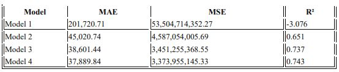

# House Price Prediction Using ANN Model

This project employs machine learning algorithms to develop a housing price prediction model using data from the 1990 California census. The model aims to assist home sellers and real estate agents in making informed decisions by providing accurate home price estimates. The research highlights that linear regression consistently outperforms other models in predicting home prices.

## Introduction

Housing price prediction is vital for stakeholders like real estate investors, buyers, and urban planners. This study aims to develop machine learning models that reliably forecast home prices based on various dataset features.

## Methodology

### 1. Data Source
Utilized the California housing dataset from the 1990 census, available on [Kaggle](https://www.kaggle.com/datasets/camnugent/californiahousing-prices).

### 2. Data Acquisition
The dataset includes various features such as longitude, latitude, and median income.

### 3. Data Preprocessing
- **Handling Missing Values**: Filled missing values in the `total_bedrooms` column with the column mean.
- **Cleaning Outliers**: Used the Interquartile Range (IQR) method for outlier detection.
- **Splitting Dataset**: Divided the data into 70% training and 30% testing.
- **Feature Scaling**: Applied `MinMaxScaler` for normalization.

Here is the dataset summary and structure after preprocessing:

### 4. Model Analysis
We implemented several machine learning models, starting with simple linear regression and increasing complexity with subsequent models.

The models and techniques explored include:
- **Model 1**: A simple baseline linear regression model.
- **Model 2**: Added complexity with hyperparameter tuning.
- **Model 3**: Further complexity enhancements and hyperparameter changes.
- **Model 4**: The final, most complex model, optimized for better performance.

## Results

We evaluated the performance of each model using metrics such as **Mean Absolute Error (MAE)**, **Mean Squared Error (MSE)**, and the **R² score**. Among the tested models, **Model 4** proved the most effective, providing the most accurate predictions with the lowest error metrics and the highest R² score.

## Visualization of Results

To understand the models' performances better, several visualizations were created, including training loss curves, predicted vs. actual values, and the distribution of residuals.

### Training Loss Curves
This graph shows the training loss over epochs for each model and helps to understand how well the models are learning over time and whether they are overfitting or underfitting.

### Predicted vs Actual Values
This scatter plot compares the predicted house prices against the actual values for the test set, helping to assess how closely the predicted values align with the actual values.

### Residuals
In the graph below, **Model 4**'s residuals are more centered around zero compared to the other models, indicating better predictions.

## Conclusion

We explored several models, including simple linear regression and more complex algorithms, and assessed their performance using key metrics such as Mean Absolute Error (MAE),
Mean Squared Error (MSE), and R² score. Among the four models we tested, Model 4 demonstrated the highest predictive accuracy, with the lowest MAE and MSE, and the highest R² score. This indicates that Model 4 is the most effThis project demonstrates the potential of machine learning in accurately predicting housing prices. It highlights the importance of data preprocessing and model selection in improving prediction accuracy.

## Technologies Used
- **Programming Language**: Python
- **Libraries**: `Pandas`, `NumPy`, `Scikit-learn`, `Matplotlib`, `Seaborn`

